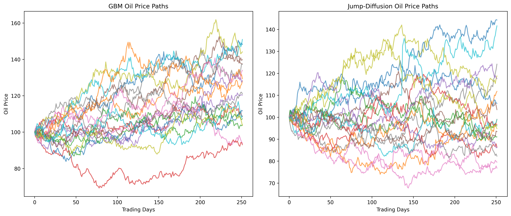
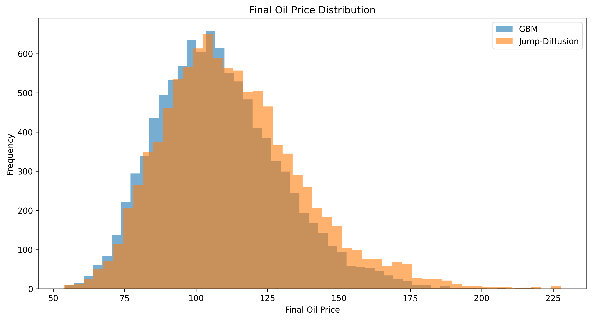
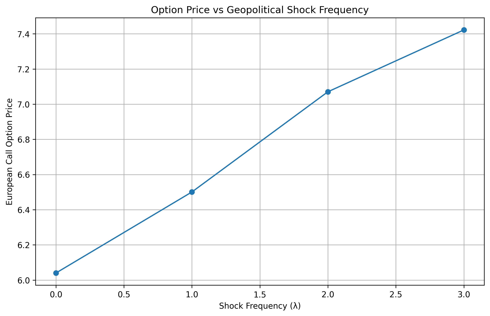

# Geopolitical Energy Shock Option Pricing Model

## Overview

This project investigates how geopolitical shock risk affects European call option pricing in energy markets.

The project compares a traditional Black-Scholes benchmark against a Merton-style jump-diffusion model. It was motivated by rising gas prices and recent energy-market instability, especially around geopolitical conflict and uncertainty in major oil supply routes.

## Motivation

At the current local gas price of approximately 1.869 CAD/L, filling a 55L tank costs about $102.80. Filling that tank four times a month costs roughly $411.18.

As a local point of comparison, a monthly adult transit pass in my area costs about $145. While this transit price is specific to my region and will not apply everywhere, it provided a useful personal benchmark. Under those assumptions, the monthly transit pass is about 2.84x cheaper than fuel alone.

That personal observation led me to explore how sudden energy-market shocks can be modeled mathematically.

## Models Used

### Geometric Brownian Motion

GBM is used as the smooth-market benchmark. It assumes prices evolve continuously over time with constant volatility.

### Black-Scholes

Black-Scholes is used to price a European call option under no-jump assumptions.

### Jump-Diffusion

The jump-diffusion model adds Poisson-driven jump events to represent sudden geopolitical energy shocks.

For option pricing, I use a compensated risk-neutral drift:

`drift = r - λ × κ`

where:

`κ = exp(jump_mean + 0.5 × jump_std²) - 1`

This prevents positive average jumps from artificially increasing expected returns.

## Results

The Black-Scholes benchmark priced the European call option at approximately **6.04**.

The compensated jump-diffusion model priced the same option at approximately **6.57**.

The sensitivity analysis showed that as annual shock frequency increased from `λ = 0` to `λ = 3`, the option price increased from approximately **6.04 to 7.42**.

## Visualizations

### GBM vs Jump-Diffusion Paths



### Final Oil Price Distribution



### Option Price Sensitivity



## How to Run

Install dependencies:

```bash
pip install -r requirements.txt
```

Run the main experiment file:

```bash
python experiments.py
```

Run individual components:

```bash
python gbm_simulation.py
python jump_diffusion.py
python option_pricing.py
```

## Files

- `gbm_simulation.py`: Simulates smooth GBM oil price paths.
- `jump_diffusion.py`: Simulates oil price paths with geopolitical jump shocks.
- `option_pricing.py`: Compares Black-Scholes and jump-diffusion option prices.
- `experiments.py`: Generates distribution, path comparison, and sensitivity analysis plots.
- `requirements.txt`: Lists the Python libraries required to run the project.
- `plots/`: Stores the visual outputs generated by the project.

## Limitations

This model is simplified and is not intended to forecast oil prices or geopolitical events.

Key limitations include:

- Constant volatility assumption
- Simplified jump-size distribution
- No calibration to live oil options data
- No stochastic interest rates
- No explicit modeling of refining margins, taxes, inventories, or exchange rates

## Article

I also wrote a Medium article explaining the motivation, methodology, and results behind this project:

[How Rising Gas Prices Led Me to Model Geopolitical Shock Risk](https://medium.com/@ameen.ahmed/when-markets-jump-how-rising-gas-prices-led-me-to-model-geopolitical-shock-risk-cc71c7d869b3)

## Takeaway

Black-Scholes remains useful as a benchmark, but it can underestimate option values when the underlying asset is exposed to discontinuous geopolitical shocks.

Jump-diffusion provides a more realistic framework for modeling event-driven energy-market risk.